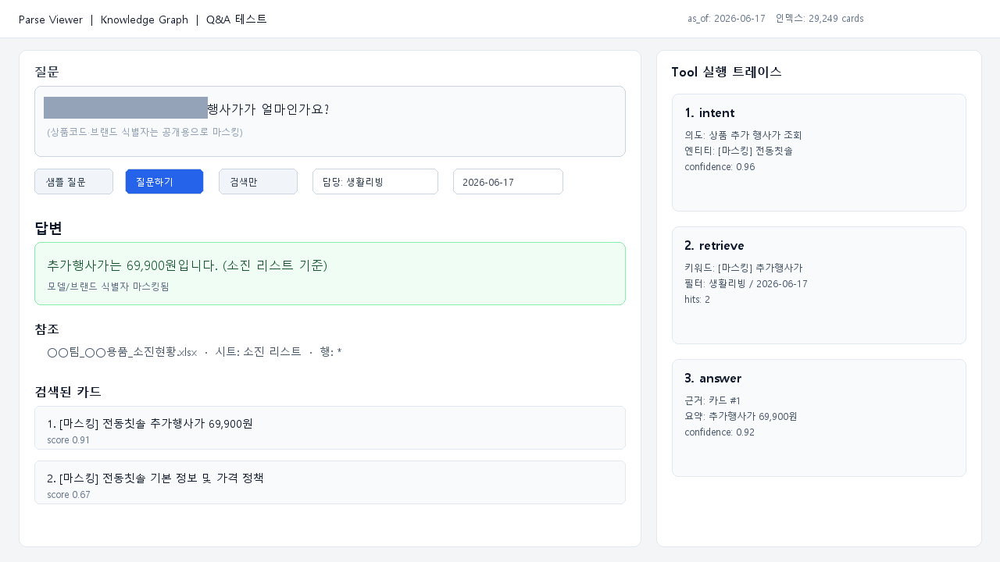

# bbskgagent / store-brief

매장 사내 게시판(제목·내용·날짜·첨부)과 담당 R&R을 바탕으로  
**담당별 업무 브리핑 · llmwiki · QA 검색**을 만드는 프로토타입입니다.

> GitHub Pages: [riosniper87.github.io/bbskgagent](https://riosniper87.github.io/bbskgagent/)

---

## 무엇을 하나요?

1. **첨부 파싱** — Excel / PPTX / PDF를 결정적으로 행·슬라이드·페이지 단위로 정규화  
2. **llmwiki** — 파싱 결과 + 상품코드 라우팅 → 담당자별 카드 corpus  
3. **검색 · QA** — BM25 인덱스 + (선택) LLM 답변, 로컬 뷰어 `/qa`  
4. **Knowledge Graph** — 출처·담당·테마 관계 시각화 (`/kg`)

날짜 계산·담당 매칭은 **결정적 코드**가 하고, LLM은 추출·요약·최종 문장만 담당합니다.

```
ingest → parse → llmwiki(+HISIS 라우팅) → BM25 index
                                           └→ viewer (parse / qa / kg)
```

---

## Knowledge Graph 온톨로지

게시글·첨부를 **WikiCard spine**으로 묶고, 상품코드·분류담당·키워드를 결정적으로 연결합니다.


| 노드 | 의미 |
|------|------|
| **Post** | 사내 게시글 |
| **Attachment** | 첨부 (xlsx / pptx / pdf) |
| **ContentSlice** | 슬라이드 · 시트 행 · PDF 페이지 |
| **WikiCard** | 검색·답변의 기본 단위 |
| **Product** | 상품코드 (`PRD_CD`) |
| **Damdang** | 분류담당 (HISIS · `cat.txt` 라우팅) |
| **Keyword** | 키워드 / 테마 태그 |

---

## Q&A 화면 예시

로컬 뷰어 `/qa`에서 질문 → BM25 검색 → (선택) LLM 답변 · 참조 · 트레이스를 한 화면에서 확인합니다.



**예시 질문(공개용):** `[브랜드·모델 마스킹] 전동칫솔 추가 행사가가 얼마인가요?`  
**기대 흐름:** 소진 리스트 행 카드 검색 → 추가행사가 금액 인용 → 첨부·source_ref 표시  
*(README/Pages 이미지에서는 상품코드·브랜드 SKU를 블러/마스킹했습니다.)*

```bash
python scripts/serve_parse_viewer.py --port 8765 --as-of 2026-06-17
# → http://localhost:8765/qa
```

---

## 빠른 시작

```bash
git clone https://github.com/riosniper87/bbskgagent.git
cd bbskgagent

cp config/settings.example.yaml config/settings.yaml
cp config/cat.txt.example config/cat.txt
cp .env.example .env   # OPENAI_API_KEY 등

pip install -e ".[viewer]"

# 로컬 뷰어 (데이터 준비 후)
python scripts/serve_parse_viewer.py --port 8765 --as-of 2026-06-17
# → http://localhost:8765
# → http://localhost:8765/qa
# → http://localhost:8765/kg
```

실데이터(`data/raw`, `data/parsed`, `data/llmwiki`)는 Git에 포함되지 않습니다.  
다른 PC에서는 **더미/샘플 데이터**로 돌리고, 코드만 `git pull`로 맞추면 됩니다.  
자세한 절차: [docs/GIT_SETUP.md](docs/GIT_SETUP.md)

---

## 주요 기능

| 영역 | 설명 |
|------|------|
| Excel 프로필 | YAML로 헤더·시트·병합열 지정 (`ingestion/profiles/`) |
| QA retrieval | damdang soft-boost, recency, topic dedup, 한국어 토큰화 |
| 파싱 품질 | PDF/PPTX/XLSX flag gates + `/quality` 리포트 |
| 회귀 eval | `scripts/run_qa_eval.py --regression-only` |

---

## 문서

| 문서 | 내용 |
|------|------|
| [docs/PROGRESS.md](docs/PROGRESS.md) | Phase별 진행 정리 |
| [docs/GIT_SETUP.md](docs/GIT_SETUP.md) | 민감정보 제외 · clone 설정 |
| [docs/excel-profiles.md](docs/excel-profiles.md) | Excel ingestion YAML |
| [docs/parsing-quality.md](docs/parsing-quality.md) | 파싱 품질 게이트 |
| [docs/qa-eval-automation.md](docs/qa-eval-automation.md) | QA eval 자동화 |

---

## 테스트

```bash
python -m pytest tests/ -q
python tests/test_core.py   # 모델 없이 핵심만
```

---

## 디렉터리

```
src/store_brief/
  ingest/ ingestion/ parse/   # 게시판·첨부 파싱
  hisis/                      # 상품코드 → 담당 라우팅
  llmwiki/ index/ qa/         # corpus · BM25 · QA
  kg/ viewer/                 # 그래프 · FastAPI UI
scripts/                      # CLI (parse, build, eval, serve)
config/                       # settings.example, maps (실데이터는 로컬)
docs/                         # 문서 + GitHub Pages
tests/
```

---

## 라이선스 · 주의

사내 프로토타입입니다. **원본 게시글·첨부·DB 자격증명·품목 마스터는 커밋하지 마세요.**  
공개 repo에 올릴 때는 Private 권장 · [GIT_SETUP](docs/GIT_SETUP.md) 체크리스트를 따르세요.
